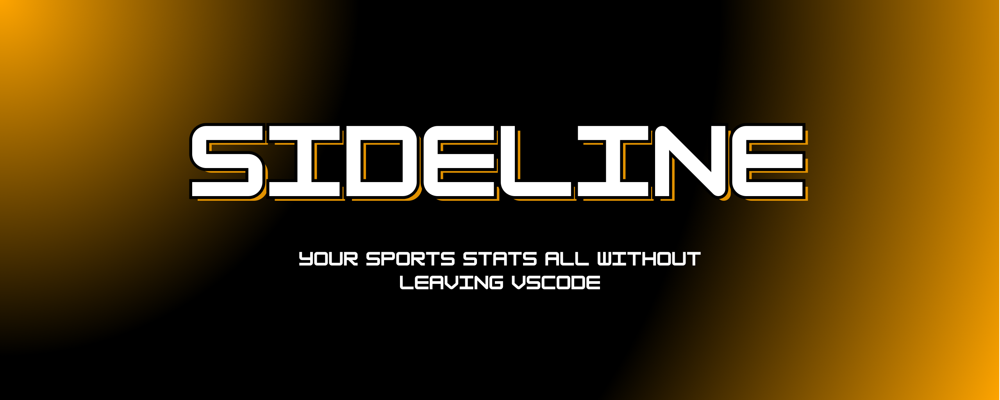

# Sideline - VS Code Sports Extension

<div align="center">
  
</div>

<div align="center">
  <h1>The Ultimate Sports Companion for Developers</h1>
  <p><strong>Never miss a game while you code. Never miss a deadline while you watch.</strong></p>
  
  
  
  
  
  
  
  <br><br>
</div>

<div align="center">
  
  
  
</div>

##  What is Sideline?

Sideline transforms VS Code into your personal sports command center. Whether you're debugging code or debugging your fantasy team, Sideline keeps you connected to the games that matter most.

**The Problem:** You're in the zone coding, but you don't want to miss that crucial touchdown, buzzer-beater, or game-winning goal.

**The Solution:** Sideline brings live sports directly into your development environment with real-time updates, smart notifications, and a beautiful interface that feels native to VS Code.

---

## Tail Your Games While You Code

Choose any game to **tail** and it will appear in your VS Code sidepanel under "Sidepanel", giving you instant access to live scores while you code. Your **tailed** games are automatically organized by sport for easy navigation.

- **Choose Games to Tail** - Click "Tail Game" on any live or upcoming match
- **View in Sidepanel** - Tailed games appear in your VS Code sidebar
- **Organized by Sport** - Games are sorted by NFL, NBA, Premier League, NHL, MLB
- **Live Updates** - Scores refresh automatically while you code
- **Smart Notifications** - Get alerts only when scores change

---

## View All Games from Our Dashboard

Our main dashboard gives you complete control over your sports viewing experience with powerful filtering and search capabilities.

- **Sort games by status** - Filter by Live, Completed, Upcoming, or Tailed games
- **Search for your favorite teams** - Find teams by name or abbreviation instantly
- **View all your currently being tailed games** - See all games you're following in one place
- **Real-time updates** - Scores and statuses refresh automatically
- **One-click tailing** - Start following any game with a single click

---

## Get Detailed Game Stats & Coverage

Click "Game Stats" on any game to get comprehensive ESPN coverage with detailed player statistics, play-by-play analysis, and all the information you need to stay informed.

- **Player Statistics** - Individual performance metrics and season stats
- **Play-by-Play Analysis** - Detailed breakdown of every play and moment
- **Team Performance** - Comprehensive team statistics and trends
- **ESPN Coverage** - Official game coverage and expert analysis
- **Real-time Updates** - Live stats that update as the game progresses

---

## Supported Sports Leagues

| Sport | Status | Coverage |
|-------|--------|----------|
|  **NFL** | ✅ Live | Full season |
|  **NBA** | ✅ Live | Full season |
|  **Premier League** | ✅ Live | Full season |
|  **NHL** | ✅ Live | Full season |
|  **MLB** | ✅ Live | Full season |

---

## Quick Start Guide

### 1. Install Sideline
- Open VS Code Extensions (`Ctrl+Shift+X`)
- Search for **"Sideline"**
- Click **Install**

### 2. Open Your Sports Dashboard
- Click the **Sideline icon** in the Activity Bar
- Or use **Command Palette** (`Ctrl+Shift+P`) → "View Games"

### 3. Start Tailing Games
1. **Browse** all current games across all sports
2. **Search** for your favorite teams
3. **Click "Tail Game"** on games you want to follow
4. **Get notified** when scores change
5. **View your games** in the sidebar widgets

### 4. Customize Your Experience
- **Configure refresh intervals** in VS Code settings
- **Filter games** by status (Live, Completed, Upcoming, Tailed)
- **Collapse sport sections** to focus on what matters
- **Search teams** by name or abbreviation

---

## Configuration

### Refresh Intervals
```json
{
  "sideline.refreshInterval": 30  // 10-300 seconds
}
```

### Available Settings
- **Refresh Interval**: How often to check for updates
- **Auto-refresh**: Enable/disable automatic updates
- **Notifications**: Control score change notifications

---

## Development

### Prerequisites
- **Node.js** v16+
- **VS Code** latest version
- **TypeScript** knowledge (optional)

### Build from Source
```bash
# Clone the repository
git clone https://github.com/yourusername/sideline.git
cd sideline

# Install dependencies
npm install

# Compile TypeScript
npm run compile

# Run in development mode
F5 in VS Code
```

### Project Architecture
```
sideline/
├── 🎯 src/
│   ├── extension.ts              # Main entry point
│   ├── sidelineProvider.ts       # Main webview provider
│   ├── trackedGamesProvider.ts   # Sidebar widget provider
│   ├── liveGameTracker.ts        # Game tracking & notifications
│   ├── sportsApi.ts              # ESPN API integration
│   ├── webview.html              # Main UI (1177 lines of awesome!)
│   └── teamColors.ts             # Team branding data
├── 📦 package.json               # Extension manifest
├── ⚙️ tsconfig.json             # TypeScript config
└── 📖 README.md                 # This masterpiece
```

### API Integration
- **ESPN Public APIs** - No keys required
- **Real-time data** - Live scores and game status
- **Multiple endpoints** - One for each sport
- **Error handling** - Graceful fallbacks

---

## Use Cases

### For Developers
- **Stay connected** to games while coding
- **Quick score checks** without leaving your editor
- **Fantasy sports** management during work hours
- **Team notifications** for important games

### For Sports Fans
- **Multi-sport tracking** in one place
- **Real-time updates** without browser switching
- **Clean interface** focused on what matters
- **Persistent tracking** across sessions

### For Teams
- **Game day monitoring** during development
- **Score tracking** for team events
- **Sports-themed** development environment
- **Fun productivity** tool

---


## Contributing

We love contributions! Here's how you can help:

### Ways to Contribute
- 🐛 **Report bugs** - Help us squash those pesky issues
- 💡 **Suggest features** - Tell us what you want to see
- 🔧 **Submit PRs** - Code contributions are always welcome
- 📖 **Improve docs** - Help others understand the project
- ⭐ **Star the repo** - Show your support

### Development Setup
```bash
# Fork and clone
git clone https://github.com/yourusername/sideline.git

# Create feature branch
git checkout -b feature/amazing-feature

# Make changes and test
npm run compile
F5 in VS Code

# Submit PR
git push origin feature/amazing-feature
```

---

## Acknowledgments

- **ESPN** for providing the sports data APIs
- **VS Code team** for the amazing extension platform
- **Open source community** for inspiration and tools
- **Sports fans everywhere** for the motivation to build this

---

<div align="center">
  <h2>🏆 Ready to Never Miss a Game Again? 🏆</h2>
  <p><strong>Install Sideline today and transform your VS Code into the ultimate sports command center!</strong></p>
  
  
  
  <br><br>
  
  <p><em>Happy coding and may your teams always win! 🚀</em></p>
  
  <br>
  
  <h3>🐛 Found a Bug? 💡 Have an Idea?</h3>
  <p><strong>Help make Sideline better! Report issues, suggest features, or share your feedback.</strong></p>
  
  <a href="https://github.com/yourusername/sideline/issues/new" target="_blank">
    
  </a>
  <a href="https://github.com/yourusername/sideline/issues/new?template=feature_request.md" target="_blank">
    
  </a>
</div>