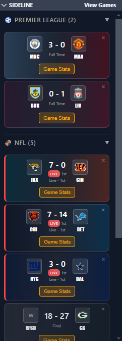
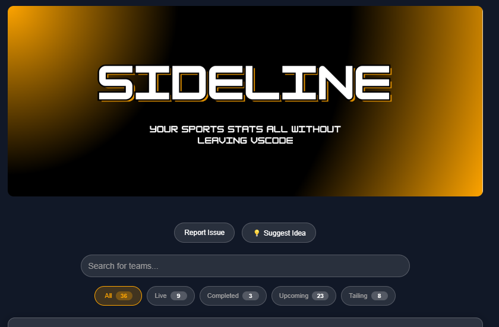

<div align="center">
  
</div>

<div align="center">
  <h1>The Ultimate Sports Companion for Developers</h1>
  <p><strong>Never miss a game while you code. Never miss a deadline while you watch.</strong></p>
  
  <div style="overflow-x: hidden; white-space: nowrap; padding: 20px 0; margin: 20px 0;">
    <div style="display: inline-block; animation: scroll 20s linear infinite;">
      
      
      
      
      
      
      
      
      
      
    </div>
  </div>
  
  <style>
    @keyframes scroll {
      0% { transform: translateX(0); }
      100% { transform: translateX(-50%); }
    }
  </style>
  
  <br>
</div>

<div align="center">
  
  
  
</div>

## What is Sideline?

Sideline transforms VS Code into your personal sports command center. Whether you're debugging code or debugging your fantasy team, Sideline keeps you connected to the games that matter most.

**The Problem:** You're in the zone coding, but you don't want to miss that crucial touchdown, buzzer-beater, or game-winning goal.

**The Solution:** Sideline brings live sports directly into your development environment with real-time updates, smart notifications, and a beautiful interface that feels native to VS Code.

---

<div style="display: flex; align-items: center; gap: 40px; margin: 40px 0;">
  <div style="flex: 1;">
    <h3 style="color: #ffffff; margin-bottom: 20px; font-size: 24px;">Tail Your Games While You Code</h3>
    <p style="color: #a0a0a0; font-size: 16px; line-height: 1.6; margin-bottom: 16px;">
      Choose any game to "<span style="color: #ffa500;">tail</span>" and it will appear in your VS Code sidepanel under "Sidepanel", giving you instant access to live scores while you code. Your <span style="color: #ffa500;">tailed</span> games are automatically organized by sport for easy navigation.
    </p>
    <ul style="color: #a0a0a0; font-size: 14px; line-height: 1.8; margin-left: -10px;">
      <li>🎯 <strong>Choose Games to Tail</strong> - Click "Tail Game" on any live or upcoming match</li>
      <li>📱 <strong>View in Sidepanel</strong> - Tailed games appear in your VS Code sidebar</li>
      <li>🏈 <strong>Organized by Sport</strong> - Games are sorted by NFL, NBA, Premier League, NHL, MLB</li>
      <li>⚡ <strong>Live Updates</strong> - Scores refresh automatically while you code</li>
      <li>🔔 <strong>Smart Notifications</strong> - Get alerts only when scores change</li>
    </ul>
  </div>
  <div style="flex: 1; text-align: center; flex-shrink: 0;" class="sidepanel-image">
    
  </div>
</div>

<style>
@media (max-width: 768px) {
  .sidepanel-image {
    display: none !important;
  }
  .dashboard-image {
    display: none !important;
  }
}
</style>

---

<div style="display: flex; align-items: center; gap: 40px; margin: 40px 0;">
  <div style="flex: 1; text-align: center; flex-shrink: 0;" class="dashboard-image">
    
  </div>
  <div style="flex: 1;">
    <h3 style="color: #ffffff; margin-bottom: 20px; font-size: 24px;">View All Games from Our Dashboard</h3>
    <p style="color: #a0a0a0; font-size: 16px; line-height: 1.6; margin-bottom: 16px;">
      Our main dashboard gives you complete control over your sports viewing experience with powerful filtering and search capabilities.
    </p>
    <ul style="color: #a0a0a0; font-size: 14px; line-height: 1.8; margin-left: -10px;">
      <li>🔍 <strong>Sort games by status</strong> - Filter by Live, Completed, Upcoming, or Tailed games</li>
      <li>🔎 <strong>Search for your favorite teams</strong> - Find teams by name or abbreviation instantly</li>
      <li>📋 <strong>View all your currently being tailed games</strong> - See all games you're following in one place</li>
      <li>⚡ <strong>Real-time updates</strong> - Scores and statuses refresh automatically</li>
      <li>📊 <strong>Individual Game Stats</strong> - Click "Game Stats" to view live coverage from the game of your choosing</li>
      <li>🎯 <strong>One-click tailing</strong> - Start following any game with a single click</li>
    </ul>
  </div>
</div>

---


## 🏆 Supported Sports Leagues

| Sport | Status | Coverage |
|-------|--------|----------|
|  **NFL** | ✅ Live | Full season |
|  **NBA** | ✅ Live | Full season |
|  **Premier League** | ✅ Live | Full season |
|  **NHL** | ✅ Live | Full season |
|  **MLB** | ✅ Live | Full season |

---

## 🚀 Quick Start Guide

### 1. **Install Sideline**
```bash
# Via VS Code Extensions
Ctrl+Shift+X → Search "Sideline" → Install

# Or install from VSIX
code --install-extension sideline-0.0.1.vsix
```

### 2. **Open Your Sports Dashboard**
- Click the **soccer ball icon** in the Activity Bar
- Or use **Command Palette** (`Ctrl+Shift+P`) → "View Games"

### 3. **Start Tailing Games**
1. **Browse** all current games across all sports
2. **Search** for your favorite teams
3. **Click "Tail Game"** on games you want to follow
4. **Get notified** when scores change
5. **View your games** in the sidebar widgets

### 4. **Customize Your Experience**
- **Configure refresh intervals** in VS Code settings
- **Filter games** by status (Live, Completed, Upcoming, Tailed)
- **Collapse sport sections** to focus on what matters
- **Search teams** by name or abbreviation

---

## 🎮 How It Works

### **Discovery Flow**
```
Open Sideline → Browse Games → Search/Filter → Tail Games → Get Notifications
```

### **Tracking Flow**
```
Tail Game → Appears in Sidebar → Auto-refresh → Score Change → Notification
```

### **Smart Features**
- **Duplicate detection** - Can't tail the same game twice
- **State persistence** - Tailed games survive VS Code restarts
- **Smart updates** - Only refreshes when data actually changes
- **Error recovery** - Gracefully handles API failures

---

## ⚙️ Configuration

### **Refresh Intervals**
```json
{
  "sideline.refreshInterval": 30  // 10-300 seconds
}
```

### **Available Settings**
- **Refresh Interval**: How often to check for updates
- **Auto-refresh**: Enable/disable automatic updates
- **Notifications**: Control score change notifications

---

## 🛠️ Development

### **Prerequisites**
- **Node.js** v16+
- **VS Code** latest version
- **TypeScript** knowledge (optional)

### **Build from Source**
```bash
# Clone the repository
git clone https://github.com/yourusername/sideline.git
cd sideline

# Install dependencies
npm install

# Compile TypeScript
npm run compile

# Run in development mode
F5 in VS Code
```

### **Project Architecture**
```
sideline/
├── 🎯 src/
│   ├── extension.ts              # Main entry point
│   ├── sidelineProvider.ts       # Main webview provider
│   ├── trackedGamesProvider.ts   # Sidebar widget provider
│   ├── liveGameTracker.ts        # Game tracking & notifications
│   ├── sportsApi.ts              # ESPN API integration
│   ├── webview.html              # Main UI (1177 lines of awesome!)
│   └── teamColors.ts             # Team branding data
├── 📦 package.json               # Extension manifest
├── ⚙️ tsconfig.json             # TypeScript config
└── 📖 README.md                 # This masterpiece
```

### **API Integration**
- **ESPN Public APIs** - No keys required
- **Real-time data** - Live scores and game status
- **Multiple endpoints** - One for each sport
- **Error handling** - Graceful fallbacks

---

## 🎯 Use Cases

### **For Developers**
- **Stay connected** to games while coding
- **Quick score checks** without leaving your editor
- **Fantasy sports** management during work hours
- **Team notifications** for important games

### **For Sports Fans**
- **Multi-sport tracking** in one place
- **Real-time updates** without browser switching
- **Clean interface** focused on what matters
- **Persistent tracking** across sessions

### **For Teams**
- **Game day monitoring** during development
- **Score tracking** for team events
- **Sports-themed** development environment
- **Fun productivity** tool

---

## 🔮 Roadmap

### **Version 1.1** (Coming Soon)
- [ ] **Team Favorites** - Save your favorite teams
- [ ] **Custom Notifications** - Sound alerts for score changes
- [ ] **Game Predictions** - Odds and predictions
- [ ] **Player Stats** - Individual player performance

### **Version 1.2** (Future)
- [ ] **Standings Tables** - League standings and rankings
- [ ] **More Sports** - NCAA, MLS, and international leagues
- [ ] **Custom Themes** - Dark/light mode customization
- [ ] **Export Data** - Export game data and stats

### **Version 2.0** (Dream Features)
- [ ] **Fantasy Integration** - Connect with fantasy platforms
- [ ] **Social Features** - Share games with team members
- [ ] **Advanced Analytics** - Game predictions and trends
- [ ] **Mobile Companion** - Sync with mobile app

---

## 🤝 Contributing

We love contributions! Here's how you can help:

### **Ways to Contribute**
- 🐛 **Report bugs** - Help us squash those pesky issues
- 💡 **Suggest features** - Tell us what you want to see
- 🔧 **Submit PRs** - Code contributions are always welcome
- 📖 **Improve docs** - Help others understand the project
- ⭐ **Star the repo** - Show your support

### **Development Setup**
```bash
# Fork and clone
git clone https://github.com/yourusername/sideline.git

# Create feature branch
git checkout -b feature/amazing-feature

# Make changes and test
npm run compile
F5 in VS Code

# Submit PR
git push origin feature/amazing-feature
```

---

## 📄 License

This project is licensed under the **MIT License**.

---

## 🙏 Acknowledgments

- **ESPN** for providing the sports data APIs
- **VS Code team** for the amazing extension platform
- **Open source community** for inspiration and tools
- **Sports fans everywhere** for the motivation to build this

---

<div align="center">
  <h2>🏆 Ready to Never Miss a Game Again? 🏆</h2>
  <p><strong>Install Sideline today and transform your VS Code into the ultimate sports command center!</strong></p>
  
  
  
  <br><br>
  
  ## 🐛 Known Issues
  
  | Issue | Status | Description |
  |-------|--------|-------------|
  | Premier League Logos | ✅ Fixed | Some team logos weren't displaying due to abbreviation mismatches |
  | VSIX Packaging | ✅ Fixed | Webview wasn't loading in packaged extension |
  | Team Colors | ✅ Fixed | Manchester United and City colors not showing |
  
  ### Recent Fixes
  - **v0.0.1**: Fixed Premier League team abbreviation mappings (MAN, MNC, BUR)
  - **v0.0.1**: Fixed VSIX packaging to include webview.html file
  - **v0.0.1**: Added proper team color mappings for all Premier League teams
  
  <p><em>Happy coding and may your teams always win! 🚀</em></p>
  
  <br>
  
  <h3>🐛 Found a Bug? 💡 Have an Idea?</h3>
  <p><strong>Help make Sideline better! Report issues, suggest features, or share your feedback.</strong></p>
  
  <a href="https://github.com/yourusername/sideline/issues/new" target="_blank">
    
  </a>
  <a href="https://github.com/yourusername/sideline/issues/new?template=feature_request.md" target="_blank">
    
  </a>
</div>
